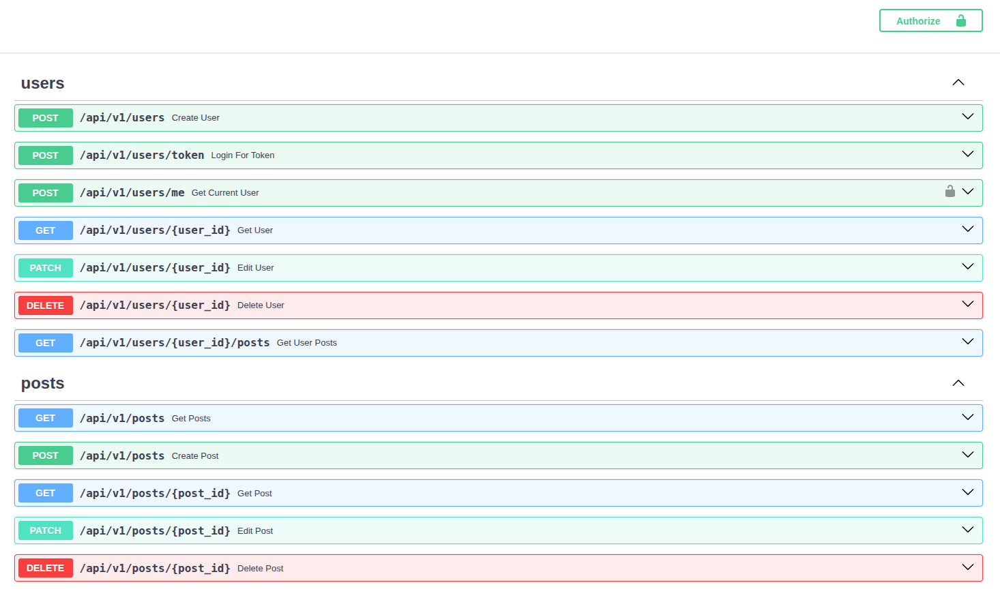

 > [!INFO]
 > This is a project from a few months ago, where I learned about OAuth 2.0 authorization and simple front-end integration. 
 > However, I plan to redesign it for hexagonal architecture in the near future. 
 > See: https://github.com/aensse/insta-ai

## About
REST API Project built on FastAPI to understand the structure of real-world, scalable applications. In addition to asynchronous logic in Python, demonstrates backend-frontend integration usingJinja2 templates. 

## Tech details:
Pydantic, SQLAlchemy,
OAuth 2.0 authorization,
simple HTML/CSS (powered by Jinja2 engine).

